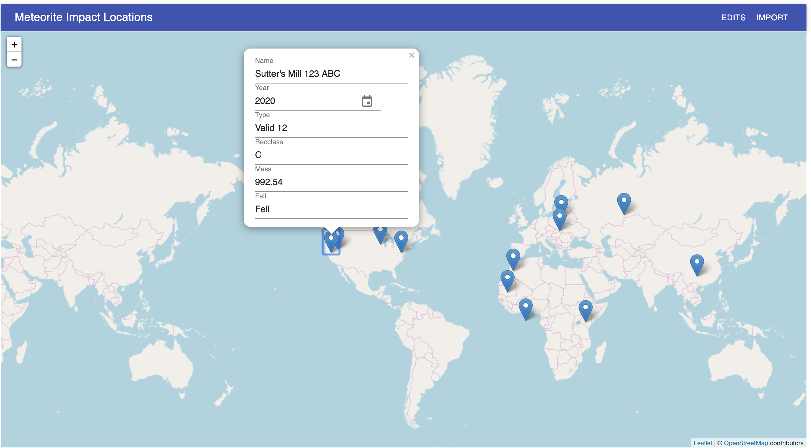

# Meteorite Impact Visualization 

> React application for visualizing Earth meteorite impact locations

## System Requirements

- [Git](https://git-scm.com/) v2 or greater
- [NodeJS](https://nodejs.org/en/) v11 or greater
- [npm](https://www.npmjs.com/) v6 or greater

## Setup

```shell
git clone https://github.com/nathanielhall/meteorite-impact-visualization.git
cd meteorite-impact-visualization
npm install
```

## Running the app

```shell
npm start
```

This will launch the application in your browser at `http://localhost:8080`. If
the browser doesn't open, try typing in the address.

This is what you are looking for:



## Scripts

| `npm <script>` | Description               |
| -------------- | ------------------------- |
| `build`        | generate production build |
| `start`        | run dev server            |
| `test`         | run jest                  |
| `lint`         | lint js(x) files          |
| `prettier`     | run prettier              |

## About the app

This application retrieves meteorite impact locations from,
https://data.nasa.gov/resource/y77d-th95.json, and plots them onto a Map. The
map is built using [React Leaflet](https://react-leaflet.js.org/).

The application provides an "Import" button that will re-import the data for the
specified start and end dates. The default start date is 2010, and the end date
is the current year. I chose to use the year rather than the full date, because
the data contains only the year.

The application provides a way to view a table of user edits. This can be
accessed by clicking the "Edits" button. This table will show all user edits in
the order of last change on top.

The table displays the following columns:

1. timestamp
2. id of the record changed
3. the original data
4. the updated data

The application allows the user to interact with the map:

1. Zooming in and out, and panning the map using the keyboard and mouse
2. Click a single point to view the associated data as a popup.
3. Make changes to the data displayed in the popup.

## Todo

These are remaining tasks:

- [x] Ability to edit the location date
- [x] Ability to edit coordinates
- [ ] More tests, mainly integration
